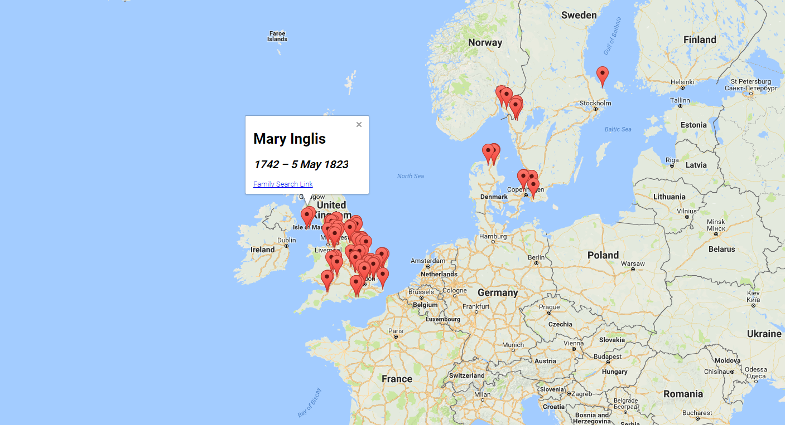

# Family Search Grave Mapper

This web app creates a visualization of where your ancestors are buried. You can use this to find ancestors buried near you so you can visit their grave sites. Have fun! 

## Setting up config.js
Create a file, called config.js, with these properties exported on a variable called config:

### mapsAPIKey
API key for the Google Maps Javscript API. You can get one [here](https://developers.google.com/maps/documentation/javascript/)

### fsAppKey
API key for Family Search API. You can get one [here](https://www.familysearch.org/developers/).

### fsEnvironment
Which Family Search environment to use. It can be either *production*, *beta*, or *integration*.

## Run it
First, run `npm install`. Then, run `npm start` to start the web app, and go to a browser. It should automatically open the app in a new tab. If anything goes wrong, feel free to open an issue. 
